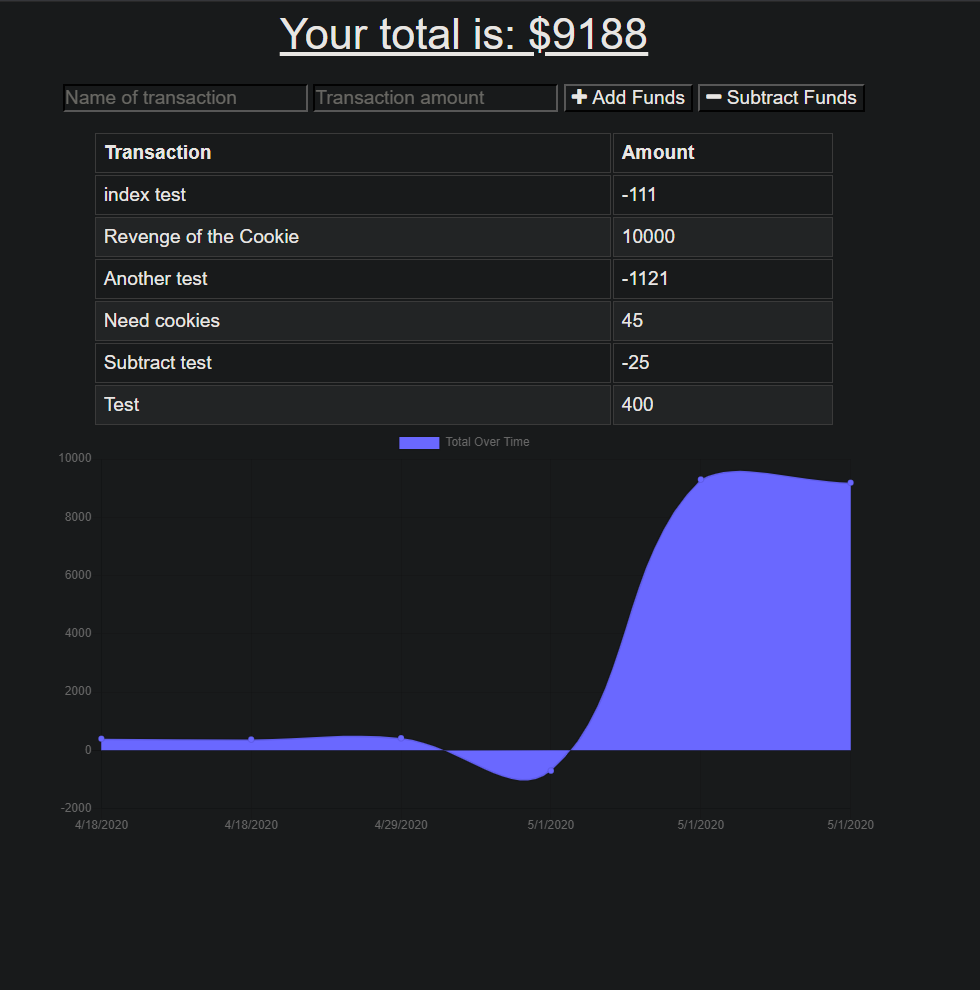

# Fitness Tracker

## Table of Contents

[Description](#description)

[Contributing](#contributing)

[Questions](#questions)

## Description

A budget tracker for keeping up with incoming and outgoing transactions. Transactions are stored in a database using mongoDB. This is a Progressive Web Application. It can be opened as a standalone app on mobile and desktop. Service worker caches data for offline use. IndexedDB syncs the data with the database when back online. 

The application was deployed using Heroku: [URL](https://lit-citadel-43444.herokuapp.com/ )

## Contributing

Not accepting pull requests at this time.

## Questions

###### For questions, please contact me at tldavis09@yahoo.com

